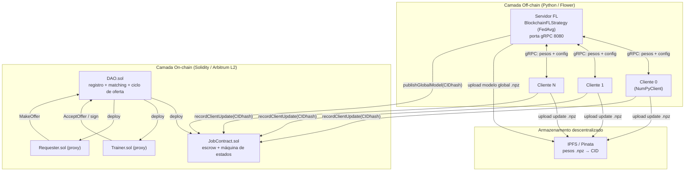
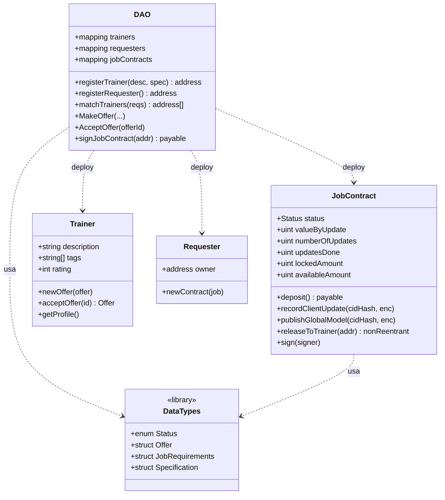
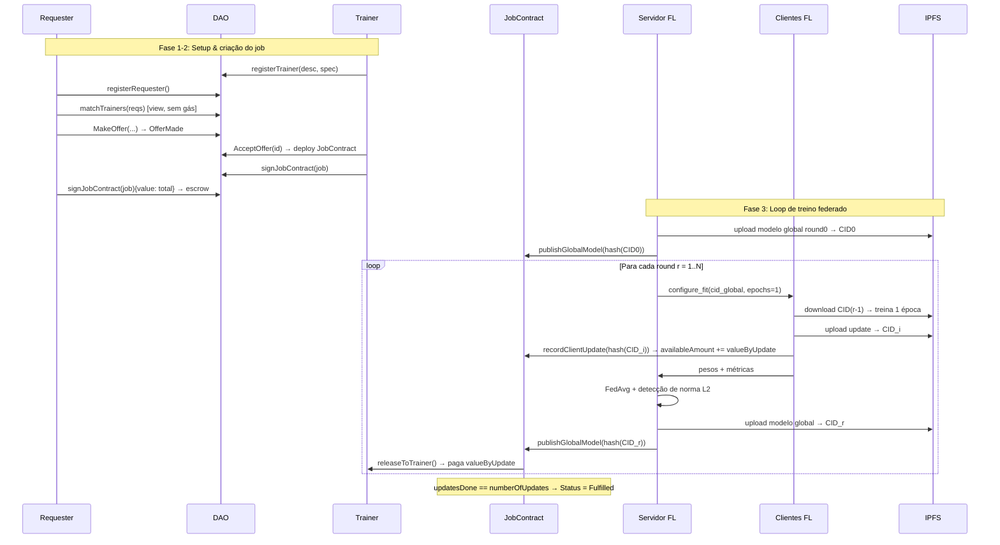

# CryptoFL — Relatório Técnico: Metodologia e Arquitetura

> Documento técnico descrevendo **o que é treinado**, **os objetivos de pesquisa** e a
> **arquitetura de software** do CryptoFL — uma plataforma de *Aprendizado Federado*
> (Federated Learning, FL) coordenada por *smart contracts* em blockchain Layer-2 e
> armazenamento descentralizado em IPFS.

---

## 1. Visão geral e objetivo

O CryptoFL investiga uma pergunta central:

> **É econômica e computacionalmente viável operar um *marketplace* de Aprendizado
> Federado coordenado por uma DAO sobre Ethereum Layer-2 (Arbitrum)?**

Em FL clássico, múltiplos participantes treinam um modelo compartilhado **sem trocar
dados brutos** — apenas os pesos/atualizações do modelo são compartilhados. O CryptoFL
adiciona a essa base três camadas:

1. **Coordenação descentralizada (blockchain)** — uma DAO faz o registro de
   participantes, o *matching* entre quem precisa de treino (Requester) e quem oferece
   poder computacional (Trainer), e gerencia contratos de trabalho com *escrow*
   (custódia de pagamento).
2. **Armazenamento descentralizado (IPFS)** — os pesos do modelo (global e atualizações
   locais) são publicados no IPFS; apenas o *hash* (CID) é ancorado on-chain, mantendo o
   custo de gás baixo.
3. **Incentivo econômico verificável** — o pagamento ao Trainer é liberado do *escrow*
   somente após cada atualização registrada on-chain, criando uma trilha de auditoria
   imutável.

### Questões de pesquisa medidas

| # | Eixo | Saída de medição |
|---|------|------------------|
| 1 | **Custo de gás** por operação do marketplace (registro, oferta, aceite, assinatura, update, publish) | `results/server_metrics_breakdown.json` |
| 2 | **Overhead vs. Flower puro** (baseline → no-IPFS → full) | estudo de ablação |
| 3 | **Escalabilidade do matching** (`matchTrainers`) conforme cresce o nº de trainers | `results/matching_load_test.json` |
| 4 | **Robustez sob clientes maliciosos** (label-flip, noise, zero) + detecção por norma L2 | `results/security_test/` |
| 5 | **Generalização além do MNIST** (CIFAR-10 não-IID + ResNet-18) | `results/cifar10_test.json` |

### Modelo de ameaça / premissas

- O **agregador off-chain é confiável** — o sistema **não** implementa agregação
  bizantina-resiliente (trabalho futuro). A detecção atual é apenas por norma L2.
- Clientes adversários **podem** envenenar rótulos, injetar ruído ou enviar zeros, mas
  **não podem** forjar transações (segurança garantida pela blockchain).
- Assume-se disponibilidade do IPFS (Pinata ou nó local) e estabilidade do RPC.

---

## 2. Metodologia de treinamento (o que estamos treinando)

### 2.1 Modelos

Dois modelos são suportados via o dispatcher `get_model(name, **kwargs)` em
[flower_fl/models.py](flower_fl/models.py):

**`MNISTNet`** — CNN para classificação de dígitos (MNIST):
- `Conv2d(1, 32, 3)` → ReLU → `Conv2d(32, 64, 3)` → ReLU
- `MaxPool2d(2)` → `Dropout(0.25)` → Flatten
- `Linear(9216, 128)` → ReLU → `Dropout(0.5)` → `Linear(128, 10)` → `LogSoftmax`

**`ResNet18Flower`** — ResNet-18 adaptada para imagens pequenas 32×32 (CIFAR-10):
- Substitui a `conv1` original `7×7/stride 2` por `3×3/stride 1, padding 1`
- Remove o `MaxPool` inicial (preserva resolução espacial)
- Camada final `Linear(512, num_classes)`; aceita `in_channels` variável (3 p/ CIFAR, 1 p/ MNIST)
- Baseada na `torchvision.models.resnet18(weights=None)` (sem pré-treino)

### 2.2 Datasets e particionamento

Em [flower_fl/datasets.py](flower_fl/datasets.py), via `load_dataset(name, node_id, num_nodes, **kwargs)`:

- **MNIST** (`load_mnist`): split **IID** — 60.000 amostras de treino divididas igualmente
  entre os nós; 10.000 de teste. Normalização μ=0.1307, σ=0.3081.
- **CIFAR-10** (`load_cifar10`): split **não-IID** via distribuição **Dirichlet(α)**. Para
  cada classe, as proporções por nó são amostradas de $p_c \sim \text{Dirichlet}(\alpha)$:
  - $\alpha = 0.1$ → fortemente não-IID (cada nó concentra poucas classes)
  - $\alpha = 0.5$ → moderadamente não-IID (**padrão**)
  - $\alpha \to 100$ → aproximadamente IID
  - Normalização per-canal μ=(0.4914, 0.4822, 0.4465), σ=(0.2470, 0.2435, 0.2616).

A semente global (`SEED`, padrão 42) garante reprodutibilidade do particionamento.

### 2.3 Hiperparâmetros de treino

| Parâmetro | Valor | Onde |
|-----------|-------|------|
| Rounds de FL | 3 (configurável via `ROUNDS`) | servidor |
| Clientes mínimos / round | 3 (`MIN_CLIENTS`) | estratégia |
| Épocas locais por round | 1 | cliente |
| Batch size | 32 | DataLoader |
| Otimizador | Adam | cliente |
| Função de perda | `NLLLoss` (saída log-softmax) | cliente |
| Dirichlet α (não-IID) | 0.5 | CIFAR-10 |

### 2.4 Agregação (FedAvg)

A estratégia `BlockchainFLStrategy` (estende `FedAvg` do Flower) em
[flower_fl/server.py](flower_fl/server.py) executa, a cada round, em `aggregate_fit`:

1. **Cálculo de normas L2** de cada atualização de cliente (vetor achatado de pesos).
2. **Detecção de anomalia** (opcional, `DETECT_ANOMALIES`): limiar
   $\tau = \mu_{norm} + k \cdot \sigma_{norm}$ (k = `NORM_THRESHOLD_STD`, padrão 2.0).
   Atualizações acima de $\tau$ são **sinalizadas e logadas** (não removidas). Detecta
   ataques que inflam a norma (`noise`, `zero`), **mas não** label-flipping (que mantém
   magnitude normal).
3. **FedAvg ponderado**: $w_{global} = \sum_i \frac{n_i}{N} w_i$, onde $n_i$ é o nº de
   amostras do cliente $i$.
4. **Publicação** (se não em modo baseline): pesos agregados → IPFS (CID) → ancoragem
   on-chain via `publishGlobalModel`.

### 2.5 Ataques adversariais (experimentos de robustez)

Em [flower_fl/client.py](flower_fl/client.py), `_apply_attack` quando `MALICIOUS=true`:

- **`label_flip`**: inverte os rótulos (`(C-1) - label`, ex.: 0↔9).
- **`noise`**: substitui imagens por ruído gaussiano (`torch.randn_like`).
- **`zero`**: substitui imagens por zeros (imagens pretas).

Controlados por `ATTACK_TYPE` e `ATTACK_PROB` (probabilidade de Bernoulli por amostra).

---

## 3. Arquitetura do sistema

### 3.1 Componentes de alto nível

A separação de camadas é deliberada: **dados de modelo pesados ficam no IPFS**, enquanto
a blockchain armazena apenas **hashes (CIDs) e estado de pagamento**, mantendo o custo de
gás constante independentemente do tamanho do modelo.

### 3.2 Camada de Aprendizado Federado (`flower_fl/`)

| Arquivo | Responsabilidade |
|---------|------------------|
| [models.py](flower_fl/models.py) | `MNISTNet`, `ResNet18Flower`, `get_model()` |
| [datasets.py](flower_fl/datasets.py) | `load_mnist` (IID), `load_cifar10` (Dirichlet não-IID), `load_dataset()` |
| [server.py](flower_fl/server.py) | `BlockchainFLStrategy` (FedAvg + L2 + IPFS + on-chain), `MetricsCollector`, servidor gRPC (8080) |
| [client.py](flower_fl/client.py) | `MNISTClient(NumPyClient)`: treino local, ataques, download/upload IPFS, `recordClientUpdate` |
| [ipfs.py](flower_fl/ipfs.py) | `ipfs_add_numpy` / `ipfs_get_numpy` (Pinata remoto ou nó local; múltiplos gateways) |
| [onchain_dao.py](flower_fl/onchain_dao.py) | Wrappers web3 do DAO: `register_*`, `match_trainers`, `make_offer`, `accept_offer`, `sign_job_contract` |
| [onchain_job.py](flower_fl/onchain_job.py) | `job_update_global` (publish), `job_send_update` (record), gás |
| [main.py](flower_fl/main.py) | Orquestração da pipeline completa (deploy → job → servidor → N clientes) |
| [baseline_runner.py](flower_fl/baseline_runner.py) | Modo *baseline* (Flower puro, sem blockchain/IPFS) na porta 8081, para comparação |
| [deploy-job.py](flower_fl/deploy-job.py) | Criação automatizada de job (registro, oferta, aceite, assinatura, escrow) |
| [deployments.py](flower_fl/deployments.py) | Descoberta de endereços de contrato (`deployments/`, `ignition/`) |
| [utils.py](flower_fl/utils.py) | Helpers de configuração (`ROUNDS`, etc.) |

**Modos de execução** (controlados por env vars):
- **Full**: IPFS + on-chain (sistema de produção).
- **No-IPFS** (`SKIP_IPFS=true` parcial): ancoragem on-chain, pesos pela rede gRPC.
- **Baseline** (`baseline_runner`): Flower puro, `gas_eth=null`, `ipfs_cid=null`.

### 3.3 Camada de Smart Contracts (`contracts/`)

- **[DAO.sol](contracts/DAO.sol)** — registro central + *matchmaking*. `matchTrainers`
  varre `registeredTrainers` (limitado por `canditatesToReturn`) aplicando filtros de
  rating, tags e descrição. É função `view` (sem gás).
- **[JobContract.sol](contracts/JobContract.sol)** — máquina de estados com *escrow*.
  Estados: `WaitingSignatures → WaitingRequester/TrainerSignature → Signed → Fulfilled`.
  Guarda `lockedAmount`/`availableAmount`, registra CIDs de updates e libera pagamento
  por update com proteção `ReentrancyGuard` (OpenZeppelin).
- **[Trainer.sol](contracts/Trainer.sol)** / **[Requester.sol](contracts/Requester.sol)** —
  contratos-proxy por participante (perfil, ofertas pendentes, jobs).
- **[DataTypes.sol](contracts/DataTypes.sol)** — biblioteca com `enum Status` e structs
  `Offer`, `JobRequirements`, `Specification`, `Evaluation`.

---

## 4. Fluxo ponta a ponta (metodologia operacional)

**Propriedades-chave garantidas:**
- **Privacidade**: nenhum dado bruto sai dos dispositivos dos clientes (garantia do FL).
- **Auditabilidade**: todo update tem CID ancorado on-chain e recuperável.
- **Escrow sem confiança**: pagamento liberado apenas após update verificado on-chain.

---

## 5. Métricas e saídas

`MetricsCollector` ([server.py](flower_fl/server.py)) grava `results/server_metrics.json`
(por round: nº de clientes, acurácia, gás em ETH, tx hash, CID, normas L2 média/desvio,
nº sinalizados, tempos) e `results/server_metrics_breakdown.json` (gás por operação).

| Métrica | Unidade | Coletor |
|---------|---------|---------|
| Acurácia / Loss | [0,1] / float | servidor & clientes |
| Gás | wei → ETH | recibo de transação |
| Latência de tx | s | timer Python |
| Tempo de treino / agregação | s | cliente / servidor |
| CID | string | resposta do gateway IPFS |
| Norma de update / nº sinalizado | norma L2 / int | detector de anomalia |

---

## 6. Stack tecnológica

**Python / FL** (ver [requirements.txt](requirements.txt)):
Flower, PyTorch (≥2.0), torchvision, NumPy (<2.0), web3.py 6.20.1, eth-account 0.8.0,
python-dotenv, requests, matplotlib.

> Observação: o `requirements.txt` fixa `flwr==1.7.0`, mas o ambiente validado nesta
> máquina roda **Flower 1.20.0** com Python 3.10. A API `start_server`/`start_client`
> usada permanece compatível (com avisos de *deprecation*).

**Smart contracts / deploy** (ver [hardhat.config.ts](hardhat.config.ts), [package.json](package.json)):
Solidity `^0.8.20` (contratos do marketplace) / `^0.8.28` (Counter), Hardhat 3,
OpenZeppelin Contracts (ReentrancyGuard, Address), Viem + Hardhat Toolbox, Hardhat
Ignition, TypeScript.

**Infraestrutura**: Arbitrum L2 (testnet/mainnet) ou nó Hardhat local (8545); IPFS Kubo
local (API 5001 / gateway 8088) ou Pinata; servidor gRPC do Flower (8080; baseline 8081).

---

## 7. Reprodutibilidade

- **Seeding** global via `SEED` (torch/numpy/random).
- **Configuração** centralizada em `.env` (RPC, chaves, endereços, dataset, modelo,
  rounds, clientes, parâmetros de ataque, flags de detecção).
- **Dados** baixados automaticamente do torchvision (MNIST/CIFAR-10).
- **Drivers de experimento**: `run.py`, `multi_run.py`, `scripts/load_test_matching.ts`,
  e o `baseline_runner` para o modo sem blockchain.
