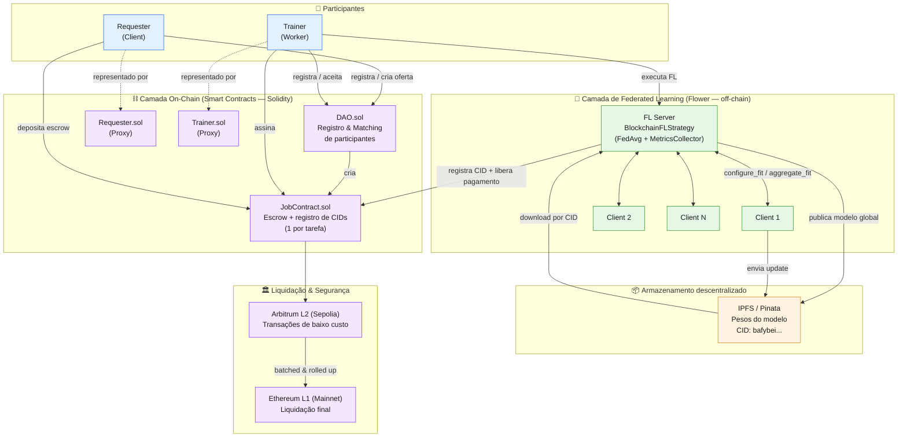
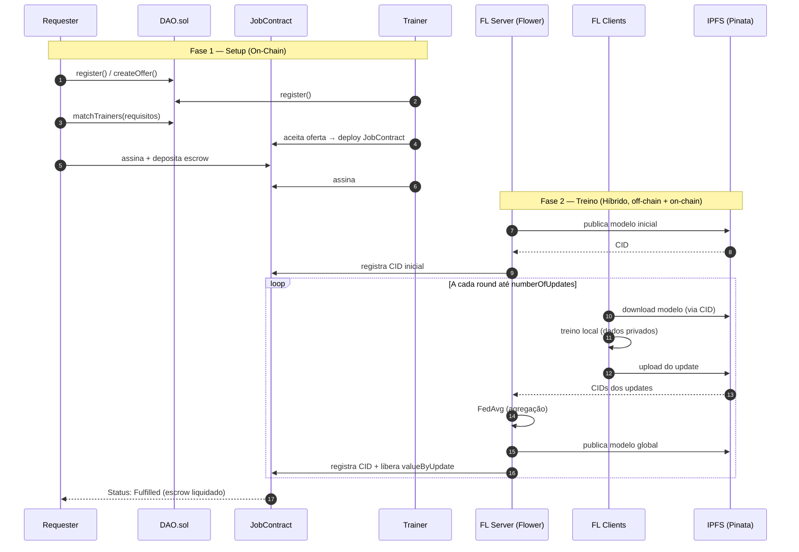

# CryptoFL — Architecture Diagram

Diagrama de arquitetura do **CryptoFL**, plataforma de Federated Learning coordenada por
contratos inteligentes (DAO marketplace) com armazenamento em IPFS e liquidação em Layer-2/Layer-1.

> Repositório: https://github.com/Luanmantegazine/cryptoFL

## Diagrama principal (componentes e fluxo)

## Diagrama de sequência (ciclo de vida de uma tarefa)

